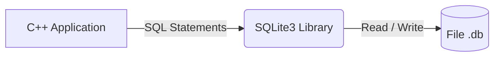
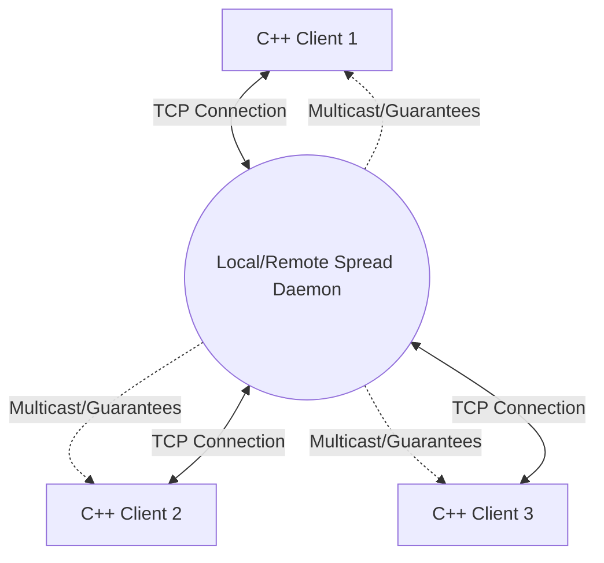
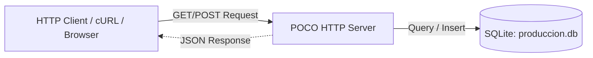
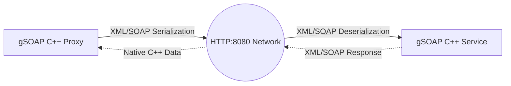

---

# 🚀 C++ Libraries Playground

This repository contains a collection of proof-of-concept projects and demonstration programs ("demos") for learning and experimenting with various popular C++ libraries in a modern environment (C++17), as well as some demos of Linux-specific functionality.

The project is managed with **CMake** and is divided into multiple independent submodules covering local databases, REST APIs, network messaging, and SOAP web services.

---

## 📂 Directory Tree

The repository is organized as follows:

```text
playground/
├── CMakeLists.txt              # Global CMake configuration to build the entire project.
├── installer.sh                # Script to install base dependencies (POCO, SQLite, gSOAP, etc.).
├── spread_installer.sh         # Script to download, build, and install the Spread Toolkit.
│
├── sqlite/                     # 1. SQLite examples
│   ├── CMakeLists.txt
│   ├── main.cpp                # Basic example: Database and table creation.
│   └── sqlite_avanzado.cpp     # Advanced example: CRUD and Prepared Statements.
│
├── spread/                     # 2. Messaging examples with Spread Toolkit
│   ├── CMakeLists.txt
│   ├── main.cpp                # Basic example: Connect to the daemon and join a group.
│   └── spread_avanzado.cpp     # Advanced example: Multicast and async receive loop.
│
├── poco/                       # 3. POCO C++ Libraries examples
│   ├── demo1/                  # Simple HTTP Client and Server
│   │   ├── CMakeLists.txt
│   │   ├── client.cpp
│   │   └── server.cpp
│   └── demo2/                  # REST API Server connected to SQLite
│       ├── CMakeLists.txt
│       └── main.cpp
│
├── gsoap/                      # 4. SOAP/XML Web Services examples with gSOAP
│   ├── demo1/                  # Basic SOAP service
│   │   ├── CMakeLists.txt
│   │   ├── client.cpp          # Client that consumes the service.
│   │   ├── server.cpp          # SOAP Server.
│   │   ├── service.h           # Initial contract header.
│   │   ├── ns1.wsdl            # WSDL contract.
│   │   └── soap*               # Auto-generated classes and stubs by gSOAP.
│   │
│   └── demo2/                  # Distributed Blackjack game
│       ├── CMakeLists.txt
│       ├── blackjack.wsdl      # Main WSDL contract for the casino.
│       ├── typemap.dat         # Data type mapping for C++.
│       ├── casino_server.cpp   # Server application (Dealer).
│       ├── jugador_client.cpp  # Client application (Player).
│       └── soap*               # Pre-included auto-generated classes (Proxy/Service).
│
└── drive_monitor_demo/
    ├── CMakeLists.txt
    ├── IDrive.h
    ├── LinuxDrive.h
    ├── LinuxDrive.cpp
    ├── BootstrapObjectFactory.h
    └── main.cpp
```

---

## 📦 Project Structure and Architecture

The following sections detail each module, how its components interact, and how to test them individually.

### 1. SQLite (`/sqlite`)

Demonstrates how to interact with local SQLite databases directly from C++.



* **Basic Example (`run_sqlite`)**: Connect to the database and create simple tables using direct queries.
* **Advanced Example (`run_sqlite_advanced`)**: Structured CRUD operations and data retrieval using *Prepared Statements* for increased security.

### 2. Spread Toolkit (`/spread`)

Examples of distributed messaging systems and group communication over a local area network using the Spread daemon.



* **Basic Example (`run_spread`)**: Connect to the local Spread daemon and join public groups.
* **Advanced Example (`run_spread_advanced`)**: Send *Multicast* messages with `AGREED_MESS` guarantee and an asynchronous receive loop to listen for regular messages and membership alerts.

### 3. POCO C++ Libraries (`/poco`)

Demonstrations of using POCO for rapid networked application development.



* **Demo 1 (`run_poco_server` and `run_poco_client`)**: A simple HTTP server that responds with JSON and a C++ client to consume that endpoint.
* **Demo 2 (`api_poco_server`)**: A full REST API Server implementing `GET` and `POST` requests. Maps domain structures to a persistent SQLite database (`produccion.db`).

### 4. gSOAP (`/gsoap`)

Development of XML/SOAP Web Services addressing WSDL contracts.



* **Demo 1**: Implementation of a client (`run_gsoap_client`) and a basic SOAP server (`run_gsoap_server`) for a remote test function (`HacerAlgo`).
* **Demo 2 (Blackjack)**: A distributed game composed of a casino server (`casino_server`) and a player client (`jugador_client`), defined via `blackjack.wsdl`.

---

## 🛠️ General Installation and Build

To build the entire project, you need a Linux environment (Ubuntu/Debian recommended).

1. **Install Dependencies**:
Run the included scripts to install build tools, SQLite, POCO, gSOAP, and compile the Spread Toolkit from source.

```bash
chmod +x installer.sh spread_installer.sh
./installer.sh
./spread_installer.sh
```
2. **Build the Project**:
From the repository root (`igt_mforce/playground/`), use CMake:
```bash
mkdir build
cd build
cmake ..
make
```

*This will generate all executables inside their respective subfolders under `build/`.*

---

## 🧪 How to Test Each Example in Detail

> **Note:** All commands assume you are inside the `build/` folder after running `make`.

### Testing SQLite

No external services required. Run the binaries directly:

```bash
./sqlite/run_sqlite
./sqlite/run_sqlite_advanced
```

* **What to expect**: You will see console messages indicating the database opened successfully, and in the advanced case, inserted records will be printed (e.g., `Carlos, 35`). You will notice `.db` files have been created in your current directory.

### Testing Spread Toolkit

**Important:** For Spread applications to work, the Spread *daemon* must be running in the background.

1. Open a terminal and start the Spread daemon:
```bash
spread
```
2. In a second terminal, run the advanced node (which will stay listening):
```bash
./spread/run_spread_advanced
```

3. In a third terminal, run the basic node to join a group and observe how the advanced node reacts to new member arrivals:
```bash
./spread/run_spread
```

### Testing POCO C++
**Demo 1 (Basic Server and Client)**
1. Start the server (port 8081):
```bash
./poco/demo1/run_poco_server
```

2. In another terminal, run the client to see the JSON response:
```bash
./poco/demo1/run_poco_client
```

**Demo 2 (REST API with Database)**
1. Start the REST server (port 8080):
```bash
./poco/demo2/api_poco_server
```

2. Use `curl` (or Postman) in another terminal to interact with the API:
* **Get user (GET)**:
```bash
curl -X GET "http://localhost:8080/api/users?id=1"
```

* **Create user (POST)**:
```bash
curl -X POST "http://localhost:8080/api/users" -H "Content-Type: application/json" -d '{"name": "Ada Lovelace", "username": "adal", "email": "ada@computing.com"}'
```

### Testing gSOAP (Blackjack)

1. In one terminal, start the casino server:
```bash
./gsoap/demo2/casino_server
```
2. In another terminal, run the player client:
```bash
./gsoap/demo2/jugador_client
```

* **What to expect**: The client will print "Pidiendo carta al crupier...". The casino server will log the request for `id_partida: 777` and send an "As de Picas". The client will receive the response and display it on screen.

---

## ⚠️ Clarification on the gSOAP Code

In the gSOAP examples directory (especially `demo2`), you will see many files such as `soapStub.h`, `soapC.cpp`, `soapBlackjackBindingProxy.cpp`, etc.

**You do NOT need to regenerate these files to run the project.** They have already been pre-generated and included in the repository to simplify compilation. The project will compile directly with `cmake` and `make`.

### What to do if you modify the contract (`blackjack.wsdl`)?

If you decide to change the web service architecture in the future (e.g., adding new functions or parameters to the XML/WSDL), **then you will** need to regenerate the intermediate C++ code.

The steps to do so (from the source folder `gsoap/demo2`) are:

1. **Generate the C++ header from the WSDL** (using the `typemap.dat` rules):
```bash
wsdl2h -t typemap.dat -o blackjack.h blackjack.wsdl
```
2. **Generate the *Stubs*, *Proxies*, and *Service* skeletons**:
```bash
soapcpp2 -j blackjack.h
```

*(The `-j` flag generates object-oriented C++ classes such as `BlackjackBindingProxy` and `BlackjackBindingService`)*.

Once regenerated, go back to your `build/` folder and run `make` again to compile the changes.

---

# Linux Drive Insertion/Removal Monitor Demo (WMI Port to udev)

This project is a complete, standalone demonstration that simulates porting a storage monitoring component from Windows (WMI) to Linux (`libudev`).

The goal is to asynchronously capture insertion and removal events for drives (Disks, USB Pendrives, etc.) using native Linux Kernel mechanisms via a background thread, notifying the main application through a callback.

---

## 🏗️ System Architecture

On Windows, WMI (Windows Management Instrumentation) is the standard for subscribing to system events such as hardware disconnection (using queries like `__InstanceDeletionEvent` over `Win32_DiskDrive`).

On Linux, the native and most efficient equivalent for handling hardware events (hotplugging/unplugging) at the system level is `udev` (specifically through the `libudev` library).

The original Windows application used asynchronous WMI queries to receive hardware change alerts. On Linux, this behavior has been replicated with the following structure:

1. **`IDrive` (Interface)**: Defines the platform-agnostic contract for starting/stopping monitoring and registering events.
2. **`LinuxDrive` (Implementation)**: Uses `libudev` to open a Netlink socket with the Kernel, filtering events from the `"block"` subsystem. Implements a `select()` loop with a *timeout* to avoid blocking and allow safe thread termination.
3. **`BootstrapObjectFactory` (Factory)**: Abstracts the instantiation of the correct class depending on the compilation platform.
4. **`main.cpp` (Demo)**: Configures the monitor, registers a lambda function as a callback, and keeps execution alive until the user decides to exit.

---

## 🪟 Prerequisites for WSL2 Users: Setting up usbipd-win

> **This section only applies if you are running this demo inside Ubuntu on WSL2.**
>
> The Linux kernel inside WSL2 does not receive USB hardware hotplug events by default. You must forward the USB device from Windows into WSL2 using **usbipd-win**. Complete these steps **before** running the demo.

### Step A — Install usbipd-win on Windows *(one-time setup)*

1. Open **PowerShell** or **Windows Terminal** as Administrator.
2. Install via `winget`:
   ```powershell
   winget install --interactive --exact dorssel.usbipd-win
   ```
   Alternatively, download the `.msi` installer directly from the
   [usbipd-win GitHub Releases](https://github.com/dorssel/usbipd-win/releases).
3. **Restart Windows** if prompted by the installer.

### Step B — Install usbip client tools inside WSL2 Ubuntu *(one-time setup)*

Open your WSL2 Ubuntu terminal and run:

```bash
sudo apt update && sudo apt install linux-tools-generic hwdata
sudo update-alternatives --install /usr/local/bin/usbip usbip \
    /usr/lib/linux-tools/*-generic/usbip 20
```

### Step C — Attach the USB pendrive (Windows → WSL2)

1. On **Windows** (PowerShell as Administrator), list available USB devices:
   ```powershell
   usbipd list
   ```
   Identify the `BUSID` of your pendrive (e.g., `2-4`).

2. **Bind** the device (one-time per device — makes it shareable):
   ```powershell
   usbipd bind --busid 2-4
   ```

3. **Attach** to WSL2 (run this **while the demo is already running** to trigger the insertion event):
   ```powershell
   usbipd attach --wsl --busid 2-4
   ```
   The device now appears inside WSL2 (e.g., `/dev/sdb`). `udev` fires an `add` event and the demo prints it immediately.

4. Verify inside WSL2 that the device is visible:
   ```bash
   lsblk
   # or check kernel messages
   dmesg | tail -20
   ```

### Step D — Detach the USB pendrive (WSL2 → Windows)

1. On **Windows** (PowerShell as Administrator), run **while the demo is running** to trigger the removal event:
   ```powershell
   usbipd detach --busid 2-4
   ```
   `udev` fires a `remove` event inside WSL2 and the demo prints it immediately.

2. Optionally **unbind** the device (stops it from being shareable until bound again):
   ```powershell
   usbipd unbind --busid 2-4
   ```

---

## Testing the demo

Follow these steps to verify the asynchronous insertion/removal detector on Linux:

### Step 1: Start the application
Once the project is compiled, run the binary from your terminal:
```bash
./drive_monitor_demo/run_drive_monitor_demo
```
You will see a message indicating the monitor is active in the background.

### Step 2: Trigger the event (Insertion)
Connect a USB Pendrive (or any external disk) to your computer.
Wait a couple of seconds for the OS to mount and recognize it.

> **On WSL2**: use `usbipd attach --wsl --busid <BUSID>` from Windows PowerShell instead of physically plugging in a device. See the [Prerequisites for WSL2 Users](#-prerequisites-for-wsl2-users-setting-up-usbipd-win) section above.

### Step 3: Trigger the event (Removal)
Physically unplug the USB Pendrive from the port.

> **On WSL2**: use `usbipd detach --busid <BUSID>` from Windows PowerShell instead.

### Step 4: Exit gracefully
To verify the background thread closes correctly without deadlocks, simply press ENTER.

## Expected Result
Immediately upon connecting/disconnecting the drive, `libudev` intercepts the Kernel event, the background thread processes it, and fires the callback to the main function.

You should see output in the terminal exactly like this:
```bash
=========================================
    Linux Drive Monitor Demo Starting    
=========================================
[INFO] Activating udev monitor...
[OK] Listening for Kernel events (Insertion/Removal) in the background...
[INFO] Press ENTER at any time to exit the demo.

[ + INSERTED ] New drive detected:
[DETAIL]: /dev/sde (disk)
-----------------------------------------

[ - REMOVED ] Drive disconnected:
[DETAIL]: /dev/sde (disk)
-----------------------------------------

[INFO] Stopping hardware monitoring services...
[OK] Demo finished successfully.
```

## Important note about the output:
It is completely normal and expected to receive multiple alerts when inserting/removing a single physical device. `udev` will emit an independent `"add"`/`"remove"` event for each logical partition (e.g., `/dev/sdb1`, `/dev/sdb2`) and finally an event for the physical disk itself (`/dev/sdb`).

---
