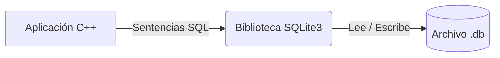
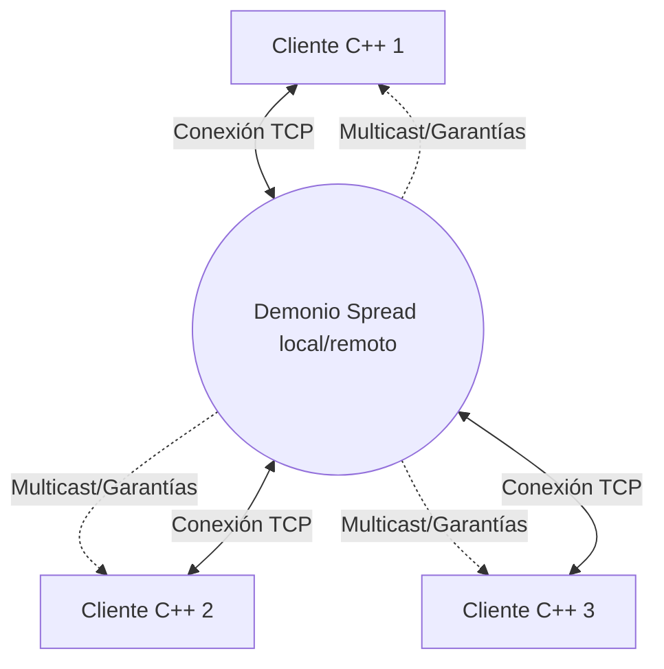
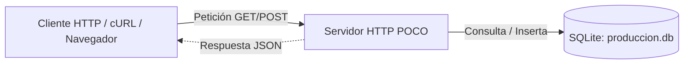
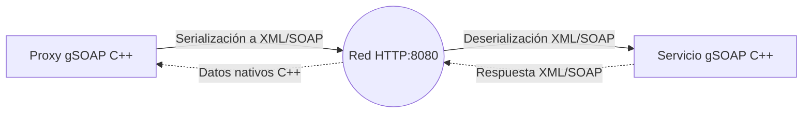

---

# 🚀 C++ Libraries Playground

Este repositorio contiene una colección de pruebas de concepto y proyectos de demostración ("demos") para aprender y experimentar con varias bibliotecas populares de C++ en un entorno moderno (C++17), asi como tambien algunas demos de funcionalidades especificas en linux.

El proyecto está gestionado con **CMake** y está dividido en múltiples submódulos independientes que abordan desde bases de datos locales y APIs REST, hasta mensajería de red y servicios web SOAP.

---

## 📂 Árbol de Directorios

El repositorio está organizado de la siguiente manera para facilitar su estudio:

```text
playground/
├── CMakeLists.txt              # Configuración global de CMake para compilar todo el proyecto.
├── installer.sh                # Script para instalar dependencias base (POCO, SQLite, gSOAP, etc.).
├── spread_installer.sh         # Script para descargar, compilar e instalar Spread Toolkit.
│
├── sqlite/                     # 1. Ejemplos de SQLite
│   ├── CMakeLists.txt
│   ├── main.cpp                # Ejemplo básico: Creación de BD y tablas.
│   └── sqlite_avanzado.cpp     # Ejemplo avanzado: CRUD y Sentencias Preparadas (Prepared Statements).
│
├── spread/                     # 2. Ejemplos de mensajería con Spread Toolkit
│   ├── CMakeLists.txt
│   ├── main.cpp                # Ejemplo básico: Conexión al demonio y unirse a un grupo.
│   └── spread_avanzado.cpp     # Ejemplo avanzado: Multicast y bucle de recepción asíncrona.
│
├── poco/                       # 3. Ejemplos de POCO C++ Libraries
│   ├── demo1/                  # Cliente y Servidor HTTP simples
│   │   ├── CMakeLists.txt
│   │   ├── client.cpp
│   │   └── server.cpp
│   └── demo2/                  # Servidor API REST conectado a SQLite
│       ├── CMakeLists.txt
│       └── main.cpp
│
├── gsoap/                      # 4. Ejemplos de Web Services SOAP/XML con gSOAP
│   ├── demo1/                  # Servicio SOAP básico
│   │   ├── CMakeLists.txt
│   │   ├── client.cpp          # Cliente que consume el servicio.
│   │   ├── server.cpp          # Servidor SOAP.
│   │   ├── service.h           # Header del contrato inicial.
│   │   ├── ns1.wsdl            # Contrato WSDL.
│   │   └── soap*               # Clases y stubs autogenerados por gSOAP.
│   │
│   └── demo2/                  # Juego de Blackjack distribuido
│       ├── CMakeLists.txt
│       ├── blackjack.wsdl      # Contrato WSDL principal del casino.
│       ├── typemap.dat         # Mapeo de tipos de datos para C++.
│       ├── casino_server.cpp   # Aplicación del servidor (Crupier).
│       ├── jugador_client.cpp  # Aplicación del cliente (Jugador).
│       └── soap*               # Clases (Proxy/Service) autogeneradas pre-incluidas.
│
└── drive_monitor_demo/
    ├── CMakeLists.txt
    ├── IDrive.h
    ├── LinuxDrive.h
    ├── LinuxDrive.cpp
    ├── BootstrapObjectFactory.h
    └── main.cpp
```

---

## 📦 Estructura del Proyecto y Arquitectura

A continuación se detallan los módulos incluidos, cómo interactúan sus componentes y cómo probarlos de forma individual.

### 1. SQLite (`/sqlite`)

Demuestra cómo interactuar con bases de datos locales SQLite directamente desde C++.



* **Ejemplo Básico (`run_sqlite`)**: Conexión a la base de datos y creación de tablas simples mediante consultas directas.
* **Ejemplo Avanzado (`run_sqlite_advanced`)**: Operaciones CRUD estructuradas y lectura de datos utilizando sentencias preparadas (*Prepared Statements*) para mayor seguridad.

### 2. Spread Toolkit (`/spread`)

Ejemplos de sistemas de mensajería distribuida y comunicación en grupo en red de área local usando el demonio Spread.



* **Ejemplo Básico (`run_spread`)**: Conexión al demonio local de Spread y unión a grupos públicos.
* **Ejemplo Avanzado (`run_spread_advanced`)**: Envío de mensajes *Multicast* con garantía `AGREED_MESS` y un bucle de recepción asíncrono para escuchar mensajes regulares y alertas de membresía.

### 3. POCO C++ Libraries (`/poco`)

Demostraciones del uso de POCO para el desarrollo rápido de aplicaciones de red.



* **Demo 1 (`run_poco_server` y `run_poco_client`)**: Un servidor HTTP sencillo que responde con JSON y un cliente C++ para consumir dicho endpoint.
* **Demo 2 (`api_poco_server`)**: Un Servidor de API REST completo que implementa peticiones `GET` y `POST`. Mapea estructuras de dominio a una base de datos SQLite persistente (`produccion.db`).

### 4. gSOAP (`/gsoap`)

Desarrollo de Servicios Web XML y SOAP, abordando contratos WSDL.



* **Demo 1**: Implementación de un cliente (`run_gsoap_client`) y un servidor SOAP (`run_gsoap_server`) básico para una función remota de prueba (`HacerAlgo`).
* **Demo 2 (Blackjack)**: Un juego distribuido compuesto por un servidor de casino (`casino_server`) y un cliente jugador (`jugador_client`), definidos mediante `blackjack.wsdl`.

---

## 🛠️ Instalación y Compilación General

Para compilar todo el proyecto, necesitas un entorno Linux (Ubuntu/Debian recomendado).

1. **Instalar Dependencias**:
Ejecuta los scripts incluidos para instalar herramientas de compilación, SQLite, POCO, gSOAP y compilar Spread Toolkit desde su código fuente.


```bash
chmod +x installer.sh spread_installer.sh
./installer.sh
./spread_installer.sh
```
2. **Compilar el Proyecto**:
Desde la raíz del repositorio (`igt_mforce/playground/`), usa CMake[cite: 1]:
```bash
mkdir build
cd build
cmake ..
make
```

*Esto generará todos los ejecutables dentro de sus respectivas subcarpetas en `build/`.*

---

## 🧪 Cómo Probar Cada Ejemplo Detalladamente

> **Nota:** Todos los comandos asumen que estás posicionado dentro de la carpeta `build/` después de haber ejecutado `make`.

### Probando SQLite

No requiere servicios externos. Ejecuta los binarios directamente:

```bash
./sqlite/run_sqlite
./sqlite/run_sqlite_advanced
```

* **Qué esperar**: Verás mensajes en consola indicando que la base de datos se abrió correctamente, y en el caso avanzado, se imprimirán en pantalla los registros insertados (ej. `Carlos, 35`). Notarás que se han creado archivos `.db` en tu directorio actual.

### Probando Spread Toolkit

**Importante:** Para que las aplicaciones de Spread funcionen, el *demonio* de Spread debe estar corriendo en tu máquina de fondo.

1. Abre una terminal y arranca el demonio de Spread:
```bash
spread
```
2. En una segunda terminal, ejecuta el nodo avanzado (que se quedará escuchando):
```bash
./spread/run_spread_advanced
```

3. En una tercera terminal, ejecuta el nodo básico para que se una a un grupo y veas cómo reacciona el nodo avanzado ante la entrada de nuevos miembros:
```bash
./spread/run_spread
```

### Probando POCO C++
**Demo 1 (Servidor y Cliente Básicos)**
1. Inicia el servidor (puerto 8081):
```bash
./poco/demo1/run_poco_server
```

2. En otra terminal, ejecuta el cliente para ver la respuesta JSON:
```bash
./poco/demo1/run_poco_client
```

**Demo 2 (API REST con Base de Datos)**
1. Inicia el servidor REST (puerto 8080):
```bash
./poco/demo2/api_poco_server
```

2. Usa `curl` (o Postman) en otra terminal para interactuar con la API:
* **Obtener usuario (GET)**:
```bash
curl -X GET "http://localhost:8080/api/users?id=1"
```

* **Crear usuario (POST)**:
```bash
curl -X POST "http://localhost:8080/api/users" -H "Content-Type: application/json" -d '{"name": "Ada Lovelace", "username": "adal", "email": "ada@computing.com"}'
```

### Probando gSOAP (Blackjack)

1. En una terminal, levanta el servidor del casino:
```bash
./gsoap/demo2/casino_server
```
2. En otra terminal, ejecuta el cliente del jugador:
```bash
./gsoap/demo2/jugador_client
```

* **Qué esperar**: El cliente imprimirá "Pidiendo carta al crupier...". El servidor del casino registrará la petición del `id_partida: 777` y enviará un "As de Picas". El cliente recibirá la respuesta y la mostrará por pantalla.

---

## ⚠️ Aclaración sobre el Código de gSOAP

En el directorio de los ejemplos de gSOAP (especialmente en `demo2`), verás muchos archivos como `soapStub.h`, `soapC.cpp`, `soapBlackjackBindingProxy.cpp`, etc.

**NO necesitas regenerar estos archivos para ejecutar el proyecto.** Ya han sido pre-generados e incluidos en el repositorio para facilitar la compilación. El proyecto compilará directamente con `cmake` y `make`.

### ¿Qué hacer si modificas el contrato (`blackjack.wsdl`)?

Si en el futuro decides cambiar la arquitectura del servicio web (por ejemplo, agregar nuevas funciones o parámetros al XML/WSDL), **entonces sí** deberás regenerar el código intermedio de C++.

Los pasos para hacerlo (desde la carpeta de código fuente `gsoap/demo2`) son:

1. **Generar la cabecera C++ a partir del WSDL** (usando las reglas de `typemap.dat`):
```bash
wsdl2h -t typemap.dat -o blackjack.h blackjack.wsdl
```
2. **Generar los *Stubs*, *Proxies* y esqueletos de *Servicio***:
```bash
soapcpp2 -j blackjack.h
```

*(El flag `-j` genera las clases C++ orientadas a objetos como `BlackjackBindingProxy` y `BlackjackBindingService`)*.

Una vez regenerados, vuelve a tu carpeta `build/` y ejecuta `make` nuevamente para compilar los cambios.

---

# Linux Drive Removal Monitor Demo (WMI Port to udev)

Este proyecto es una demostración completa e independiente que simula la portabilidad de un componente de monitoreo de almacenamiento desde Windows (WMI) hacia Linux (`libudev`). 

El objetivo es capturar de forma asíncrona los eventos de extracción de unidades (Discos, Pendrives USB, etc.) utilizando mecanismos nativos del Kernel de Linux mediante un hilo en segundo plano, notificando a la aplicación principal a través de un callback.

---

## 🏗️ Arquitectura del Sistema
En Windows, WMI (Windows Management Instrumentation) es el estándar para suscribirse a eventos del sistema como la desconexión de hardware (usando consultas como __InstanceDeletionEvent sobre Win32_DiskDrive).

En Linux, el equivalente nativo y más eficiente para manejar eventos de hardware (hotplugging/unplugging) a nivel de sistema es udev (específicamente a través de la librería libudev).

En Windows, la aplicación original utilizaba consultas WMI asíncronas para recibir alertas de cambios de hardware. En Linux, hemos replicado este comportamiento con la siguiente estructura:

1. **`IDrive` (Interfaz)**: Define el contrato agnóstico de la plataforma para iniciar/detener el monitoreo y registrar eventos.
2. **`LinuxDrive` (Implementación)**: Utiliza `libudev` para abrir un socket Netlink con el Kernel, filtrando eventos del subsistema `"block"`. Implementa un bucle `select()` con *timeout* para evitar bloqueos y permitir una finalización segura del hilo.
3. **`BootstrapObjectFactory` (Fábrica)**: Abstrae la instanciación de la clase correcta dependiendo de la plataforma de compilación.
4. **`main.cpp` (Demo)**: Configura el monitor, registra una función lambda como callback y mantiene viva la ejecución hasta que el usuario decida salir.

## Probando la demo

Sigue estos pasos para verificar el funcionamiento del detector asíncrono de extracción de unidades en Linux:

### Paso 1: Iniciar la aplicación
Una vez compilado el proyecto, ejecuta el binario desde tu terminal:
```bash
./drive_monitor_demo/run_drive_monitor_demo
```

### Paso 2: Preparar el escenario
Al ejecutarlo, verás un mensaje indicando que el monitor está activo en segundo plano. En este momento:
Conecta un Pendrive USB (o cualquier disco externo) a tu computadora.
Espera un par de segundos para que el sistema operativo lo monte y lo reconozca.

### Paso 3: Disparar el evento (Extracción)
Ahora, desconecta físicamente el Pendrive USB del puerto (puedes simplemente desenchufarlo).

### Paso 4: Finalizar la ejecución de forma segura
Para comprobar que el hilo en segundo plano se cierra correctamente y no hay bloqueos (deadlocks), simplemente presiona la tecla ENTER.

## Resultado Esperado
Inmediatamente al desconectar la unidad, libudev interceptará el evento del Kernel, nuestro hilo en segundo plano lo procesará y disparará el callback hacia la función principal.

Deberías ver una salida en la terminal exactamente como esta:
```bash
=========================================
  Iniciando Demo de Monitoreo en LINUX   
=========================================
[INFO] Activando el monitor udev...
[OK] Buscando eventos del Kernel en segundo plano...
[INFO] Presiona ENTER en cualquier momento para salir de la demo.

[ALERTA RECIBIDA EN MAIN] Una unidad ha sido desconectada del sistema!
[DETALLE]: /dev/sdb1 (partition)
-----------------------------------------

[ALERTA RECIBIDA EN MAIN] Una unidad ha sido desconectada del sistema!
[DETALLE]: /dev/sdb (disk)
-----------------------------------------

[INFO] Deteniendo servicios de monitoreo de hardware...
[OK] Demo finalizada con éxito.
```

## Nota importante sobre el resultado:
Es completamente normal y esperado recibir múltiples alertas al retirar un solo dispositivo físico. udev emitirá un evento "remove" independiente para cada partición lógica (por ejemplo, /dev/sdb1, /dev/sdb2) y finalmente un evento para el disco físico en sí (/dev/sdb).

---
